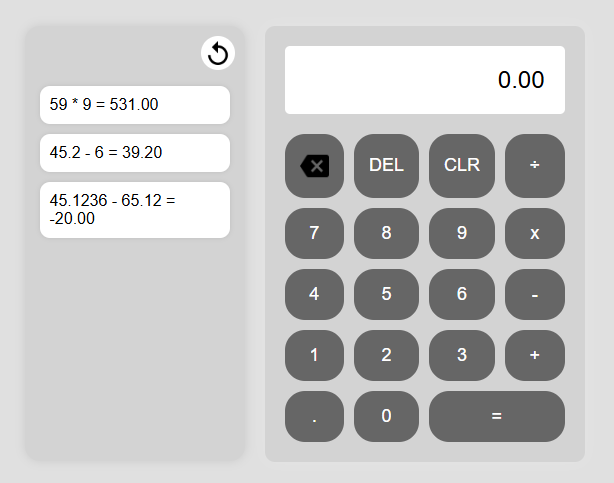

# **Calculadora Web Básica - Versión 1.0**

Aplicación web para realizar operaciones matemáticas básicas (suma, resta, multiplicación, división) con historial de operaciones.

## **Estado Actual** ✅

Esta es la **versión 1.0** de la calculadora, con las siguientes funcionalidades implementadas:

- Realización de operaciones básicas.
- Interfaz intuitiva y fácil de usar.
- Botón de borrado para limpiar resultados y historial.
- Resultados mostrados con dos decimales.

## **Características Principales** ✨

✔️ **Operaciones matemáticas:** suma, resta, multiplicación y división.
✔️ **Historial de operaciones:** se almacena y muestra en la interfaz.
✔️ **Diseño responsivo:** compatible con dispositivos móviles y escritorio.
✔️ **Interfaz clara y moderna:** Diseñada con HTML, CSS y JavaScript puro.

## **Requerimientos Cumplidos** 📌

| ID  | Descripción               | Estado |
| --- | ------------------------- | ------ |
| RQ1 | Operaciones básicas       | ✔️     |
| RQ2 | Interfaz gráfica          | ✔️     |
| RQ3 | Resultado con 2 decimales | ✔️     |
| RQ4 | Historial de operaciones  | ✔️     |
| RQ5 | Botones de borrado        | ✔️     |

## **Tecnologías Usadas** 🛠️

- **HTML5** → Estructura de la calculadora.
- **CSS3** → Estilos con Grid y Flexbox.
- **JavaScript Vanilla** → Lógica de operaciones e historial.

## **Instalación y Uso** 🚀

1. Clona el repositorio:
   ```bash
   git clone https://github.com/Luis-Ant/Calculadora-Web-Basica-.git
   ```
2. Abre el archivo `index.html` en tu navegador.
3. ¡Disfruta de tu calculadora con historial de operaciones! 🎉

## **Captura de Pantalla** 🖼️

## 

📌 **Repositorio:** [Calculadora Web Básica](https://github.com/Luis-Ant/Calculadora-Web-Basica-)
